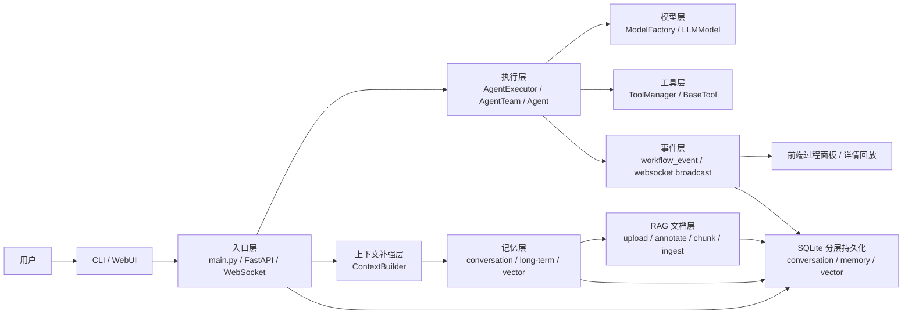
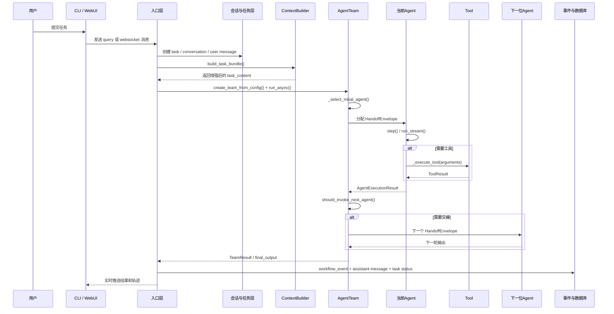

# AgentMesh 项目运行机制梳理（深度版）

## 1. 这份文档怎么读

这份文档的目标不只是“告诉你项目里有什么文件”，而是解释：

1. 系统是如何被启动起来的。
2. 一条任务如何从输入走到最终答案。
3. 中途有哪些关键函数、关键字段、关键数据结构在参与。
4. 为什么当前实现会这样设计，以及这些设计对维护和排障意味着什么。

全文会尽量做到两件事同时成立：

- **专业性**：明确指出关键函数、关键类、关键字段和它们的职责边界。
- **可读性**：不是把源码逐行翻译，而是解释这些实现为什么重要、彼此如何配合。

在阅读时，先记住一个非常关键的事实：

**AgentMesh 不是一个“单模型聊天壳子”，而是一个“配置驱动的多智能体协作执行系统”。**

它的核心不是“让某个模型直接回答”，而是：

**装配团队 -> 组织上下文 -> 协调角色 -> 调工具 -> 交接给下一个角色 -> 产出最终答案 -> 记录全过程。**

## 2. 项目整体是什么

### 2.1 通俗理解

如果用通俗的话来讲，AgentMesh 很像一个“AI 项目组”：

- 你给它一个任务。
- 它先看这个任务属于什么类型。
- 决定先派哪个角色来做。
- 角色在做的过程中可以自己去查资料、读文件、跑命令、调用浏览器。
- 做完之后，系统再判断是不是要交给下一个角色继续推进。
- 整个过程不仅有最终答案，还会留下完整的协作轨迹。

因此，它比普通聊天应用多了三层能力：

1. **协作层**：多个 Agent 串联处理任务。
2. **工具层**：Agent 可以发起外部动作。
3. **记忆层**：任务在执行前会先补充长期记忆、会话记忆和文档检索结果。

### 2.2 核心模块地图

| 模块 | 主要职责 | 关键文件 | 关键函数 / 类 |
| --- | --- | --- | --- |
| 运行入口层 | 决定系统以 CLI 还是 Web 方式启动 | `main.py`（文件位置：`/Users/qijinyu.0608/Downloads/AgentMesh-main/main.py`） | `main()`、`list_available_teams()` |
| API 组装层 | 创建 FastAPI 应用并挂载路由 | `agentmesh/api/app.py`（文件位置：`/Users/qijinyu.0608/Downloads/AgentMesh-main/agentmesh/api/app.py`） | `create_app()` |
| 团队装配层 | 把 YAML 配置变成可运行的团队对象 | `agentmesh/service/agent_executor.py`（文件位置：`/Users/qijinyu.0608/Downloads/AgentMesh-main/agentmesh/service/agent_executor.py`） | `create_team_from_config()`、`execute_task_with_team_streaming()` |
| 团队调度层 | 决定谁先执行、是否需要交接、如何收束最终答案 | `agentmesh/protocol/team.py`（文件位置：`/Users/qijinyu.0608/Downloads/AgentMesh-main/agentmesh/protocol/team.py`） | `run()`、`run_async()`、`_select_initial_agent()`、`_process_agent_chain()` |
| 单 Agent 执行层 | 负责单个角色的 prompt 组织、工具循环和结果记录 | `agentmesh/protocol/agent.py`（文件位置：`/Users/qijinyu.0608/Downloads/AgentMesh-main/agentmesh/protocol/agent.py`） | `step()`、`run_stream()`、`should_invoke_next_agent()` |
| 流式执行层 | 管理模型多轮输出和工具调用循环 | `agentmesh/protocol/agent_stream.py`（文件位置：`/Users/qijinyu.0608/Downloads/AgentMesh-main/agentmesh/protocol/agent_stream.py`） | `run_stream()`、`_call_llm_stream()`、`_execute_tool()` |
| 配置层 | 加载 `config.yaml` 并提供全局配置访问 | `agentmesh/common/config/config_manager.py`（文件位置：`/Users/qijinyu.0608/Downloads/AgentMesh-main/agentmesh/common/config/config_manager.py`） | `load_config()`、`config()`、`ensure_config_loaded()` |
| 模型工厂层 | 根据模型名和 provider 生成模型实例 | `agentmesh/models/model_factory.py`（文件位置：`/Users/qijinyu.0608/Downloads/AgentMesh-main/agentmesh/models/model_factory.py`） | `get_model()`、`_determine_model_provider()` |
| 工具管理层 | 发现工具、实例化工具、合并运行时配置 | `agentmesh/tools/tool_manager.py`（文件位置：`/Users/qijinyu.0608/Downloads/AgentMesh-main/agentmesh/tools/tool_manager.py`）、`agentmesh/tools/base_tool.py`（文件位置：`/Users/qijinyu.0608/Downloads/AgentMesh-main/agentmesh/tools/base_tool.py`） | `load_tools()`、`create_tool()`、`list_tools()`、`BaseTool.execute_tool()` |
| Skill 管理层 | 从 skill 目录发现 skill，并把 prompt / tools 合并到 Agent | `agentmesh/skills/skill_manager.py`（文件位置：`/Users/qijinyu.0608/Downloads/AgentMesh-main/agentmesh/skills/skill_manager.py`） | `load_skills()`、`resolve_skills()` |
| 上下文补强层 | 在执行前注入长期记忆、会话记忆、向量检索和最近消息 | `agentmesh/service/context_builder.py`（文件位置：`/Users/qijinyu.0608/Downloads/AgentMesh-main/agentmesh/service/context_builder.py`） | `build_task_bundle()`、`build_task_content()` |
| 会话层 | 管理 conversations、messages、summary | `agentmesh/service/conversation_service.py`（文件位置：`/Users/qijinyu.0608/Downloads/AgentMesh-main/agentmesh/service/conversation_service.py`） | `create_conversation()`、`append_message()`、`list_recent_messages()`、`upsert_summary()` |
| 记忆总入口 | 统一管理长期记忆、会话记忆、向量搜索和文档入库 | `agentmesh/service/unified_memory_service.py`（文件位置：`/Users/qijinyu.0608/Downloads/AgentMesh-main/agentmesh/service/unified_memory_service.py`） | `create_memory_item()`、`search_vector()`、`put_long_term_memory()`、`ingest_document()` |
| 向量层 | 负责 embedding、索引缓存、向量搜索 | `agentmesh/service/vector_memory_service.py`（文件位置：`/Users/qijinyu.0608/Downloads/AgentMesh-main/agentmesh/service/vector_memory_service.py`） | `embed_text()`、`upsert_embedding()`、`search()`、`invalidate_index_cache()` |
| RAG 文档层 | 负责上传文档、分块、注释、切块入索引 | `agentmesh/service/rag_ingest_service.py`（文件位置：`/Users/qijinyu.0608/Downloads/AgentMesh-main/agentmesh/service/rag_ingest_service.py`） | `save_upload()`、`set_annotation()`、`ingest_document()` |
| 实时任务层 | 接收 WebSocket 输入、发起任务、广播事件 | `agentmesh/service/websocket_service.py`（文件位置：`/Users/qijinyu.0608/Downloads/AgentMesh-main/agentmesh/service/websocket_service.py`） | `process_user_input()`、`execute_task()`、`broadcast_to_task()` |
| 事件回放层 | 把 workflow event 落库并生成协作图、聚合指标 | `agentmesh/service/workflow_event_store.py`（文件位置：`/Users/qijinyu.0608/Downloads/AgentMesh-main/agentmesh/service/workflow_event_store.py`） | `append_event()`、`list_events()`、`compute_graph()`、`compute_metrics()` |
| 数据库层 | 管理 SQLite 路径、schema 初始化和连接行为 | `agentmesh/common/database.py`（文件位置：`/Users/qijinyu.0608/Downloads/AgentMesh-main/agentmesh/common/database.py`） | `_build_db_paths()`、`DatabaseManager` |
| 前端会话态 | 维护会话、任务、事件和恢复后的 Agent 轨迹 | `frontend/src/stores/sessionStore.js`（文件位置：`/Users/qijinyu.0608/Downloads/AgentMesh-main/frontend/src/stores/sessionStore.js`） | `useSessionStore()`、`mapWorkflowEvent()`、`buildRecoveredAgentMessages()` |
| 前端任务流 | 建立 WebSocket 连接并接收过程消息 | `frontend/src/composables/useTaskStream.js`（文件位置：`/Users/qijinyu.0608/Downloads/AgentMesh-main/frontend/src/composables/useTaskStream.js`） | `connectProcessSocket()`、`connectTaskStreamSocket()` |
| 前端展示层 | 呈现流程面板、调度面板、工具结果和详情页 | `frontend/src/components/ConversationWorkspace.vue`（文件位置：`/Users/qijinyu.0608/Downloads/AgentMesh-main/frontend/src/components/ConversationWorkspace.vue`）、`frontend/src/components/ProcessPanel.vue`（文件位置：`/Users/qijinyu.0608/Downloads/AgentMesh-main/frontend/src/components/ProcessPanel.vue`）、`frontend/src/components/DispatchPanel.vue`（文件位置：`/Users/qijinyu.0608/Downloads/AgentMesh-main/frontend/src/components/DispatchPanel.vue`）、`frontend/src/pages/TaskCollaborationDetailPage.vue`（文件位置：`/Users/qijinyu.0608/Downloads/AgentMesh-main/frontend/src/pages/TaskCollaborationDetailPage.vue`） | 过程可视化、任务详情回放、运行时调度配置 |

### 2.3 总体架构图



### 2.4 端到端时序图



## 3. 启动与入口层

### 3.1 命令行入口：`main.py`（文件位置：`/Users/qijinyu.0608/Downloads/AgentMesh-main/main.py`）

从业务上看，命令行入口解决的是“我不需要前端界面，也能立刻把一个任务交给 AgentMesh 去跑”的问题。它适合研发调试、快速验证团队配置、做本地实验，或者在服务器环境中直接执行任务。对使用者来说，这一层像是系统的总开关，你只要告诉它“用哪个团队、跑什么任务、要不要启动服务”，它就会把后面的配置加载、团队装配和执行流程全部串起来。

`main.py`（文件位置：`/Users/qijinyu.0608/Downloads/AgentMesh-main/main.py`）是整个系统最上层的总入口。`main()` 做的事情其实很清晰：

1. 解析命令行参数。
2. 调用 `load_config()` 读取配置。
3. 创建 `AgentExecutor()`。
4. 根据参数决定进入哪种模式。

#### 关键函数

| 函数 | 作用 | 为什么重要 |
| --- | --- | --- |
| `main()` | 统一分发 CLI 单次执行、CLI 交互、API 服务启动 | 这是所有运行方式的总开关 |
| `list_available_teams()` | 列出配置中的团队 | 是排查“为什么团队名无效”的第一入口 |

#### 关键参数

| 参数 | 对应字段 | 含义 |
| --- | --- | --- |
| `-t` / `--team` | `args.team` | 指定要运行的团队名 |
| `-l` / `--list` | `args.list` | 只列出团队，不执行任务 |
| `-q` / `--query` | `args.query` | 单次执行模式下的任务文本 |
| `-s` / `--server` | `args.server` | 启动 FastAPI + WebSocket 服务 |
| `-p` / `--port` | `args.port` | API 服务端口，默认 `8001` |

#### 运行机制解读

这里有一个值得特别指出的实现细节：

- **CLI 单次模式** 会直接调用 `team.run(Task(...), output_mode="print")`。
- **CLI 交互模式** 每轮输入后会重新用 `create_team_from_config()` 创建一套团队对象。

这说明 CLI 交互更偏向“多次任务循环”，而不是“同一套长生命周期 Agent 团队在本地持续保留所有运行态”。

### 3.2 Web 应用入口：`agentmesh/api/app.py`（文件位置：`/Users/qijinyu.0608/Downloads/AgentMesh-main/agentmesh/api/app.py`）

从业务上看，Web 应用入口解决的是“让 AgentMesh 变成一个可被页面、其他系统、甚至后续外部平台调用的服务”这个问题。它的意义不只是把命令行功能搬到线上，而是把任务执行、记忆管理、会话历史、工作流回放这些能力包装成统一的接口，让前端页面和后续集成系统都能稳定地接入。

FastAPI 应用由 `create_app()` 组装。这个函数会先调用 `ensure_config_loaded()`，再创建应用对象、配置 CORS，然后挂载一组 router。

#### 关键函数

| 函数 | 作用 |
| --- | --- |
| `create_app()` | 创建 FastAPI 应用实例 |
| 全局异常处理器 | 把未处理异常统一包装成 `{code, message, data}` 风格响应 |

#### 挂载的路由模块

| 路由模块 | 主要职责 |
| --- | --- |
| `task_router` | 任务查询、健康检查、工作流回放、协作图、指标 |
| `websocket_router` | WebSocket 任务执行与任务级事件订阅 |
| `memory_router` | 长期记忆与 memory item 管理 |
| `conversation_router` | conversation、messages、summary 管理 |
| `config_router` | 读取配置、校验配置、列工具 |
| `rag_ingest_router` | 文档上传、标注、切块和入索引 |

#### 关键环境变量

| 环境变量 | 作用 |
| --- | --- |
| `AGENTMESH_CORS_ORIGINS` | 控制 FastAPI 的 `allow_origins` |

### 3.3 前端接入入口：`frontend/src/composables/useApiBase.js`（文件位置：`/Users/qijinyu.0608/Downloads/AgentMesh-main/frontend/src/composables/useApiBase.js`）与 `frontend/src/composables/useTaskStream.js`（文件位置：`/Users/qijinyu.0608/Downloads/AgentMesh-main/frontend/src/composables/useTaskStream.js`）

从业务上看，这一层解决的是“页面到底该连到哪里，以及怎样持续收到任务执行中的变化”。用户在页面上看到的发送按钮、过程刷新、详情页实时更新，本质上都依赖这里提供的地址解析和 WebSocket 建联能力。它把后端地址和实时通信方式收敛成一套前端可复用的基础设施。

前端的网络入口其实被收敛得很简单：

- `getApiBase()`：返回 `VITE_API_BASE`，默认是 `http://localhost:8001`。
- `getWsBase()`：把 `http` 替换成 `ws`。
- `connectProcessSocket()`：连接 `/api/v1/task/process`。
- `connectTaskStreamSocket()`：连接 `/api/v1/tasks/{task_id}/stream`。

#### 关键字段

| 字段 | 含义 |
| --- | --- |
| `VITE_API_BASE` | 前端指向的后端 API 基地址 |
| `wsStatus` | 前端 WebSocket 状态，取值如 `disconnected`、`connecting`、`connected` |

#### 运行机制解读

前端不是“等结果再刷新页面”，而是从入口层就被设计成：

**提交任务的 socket** 与 **订阅任务详情的 socket** 分离。

这使它既能实时发起任务，也能单独打开一个详情页去订阅同一任务的增量事件。

## 4. 配置与运行时装配机制

### 4.1 配置加载：`agentmesh/common/config/config_manager.py`（文件位置：`/Users/qijinyu.0608/Downloads/AgentMesh-main/agentmesh/common/config/config_manager.py`）

从业务上看，配置加载解决的是“系统今天到底该按什么规则工作”。没有这一层，团队是谁、模型用哪个、工具能不能用、数据库写到哪里，全都没有统一答案。它在业务上的作用像一份运行中的总装说明书，决定了同一套代码在不同环境里可以表现成什么样的智能体系统。

配置层本身不复杂，但它是所有运行逻辑的前提。

#### 关键函数

| 函数 | 作用 | 说明 |
| --- | --- | --- |
| `load_config()` | 从根目录读取 `config.yaml`（文件位置：`/Users/qijinyu.0608/Downloads/AgentMesh-main/config.yaml`） | 失败时不会让进程立刻退出，而是把全局配置置空 |
| `config()` | 获取当前内存中的配置对象 | 带懒加载行为 |
| `ensure_config_loaded()` | 保证配置已加载 | FastAPI 启动时常用 |

#### 关键文件

`config.yaml`（文件位置：`/Users/qijinyu.0608/Downloads/AgentMesh-main/config.yaml`）

#### 关键配置字段

| 配置路径 | 含义 | 运行时影响 |
| --- | --- | --- |
| `models.<provider>.api_base` | 模型接口基地址 | 决定请求发向哪里 |
| `models.<provider>.api_key` | 模型密钥 | 决定模型能否成功调用 |
| `models.<provider>.models` | 该 provider 可选模型列表 | `ModelFactory` 会据此识别 provider |
| `tools.<tool_name>` | 工具静态配置 | 实例化工具时会注入到 `tool.config` |
| `database.db_path` | 任务/旧主库路径 | 当前更多是兼容字段 |
| `database.conversation_db_path` | 任务、事件、会话相关 DB | Web 模式最常读写 |
| `database.memory_db_path` | memory items 和 RAG 文档 DB | 记忆与知识库核心存储 |
| `database.vector_db_path` | embedding 和向量元数据 DB | 检索性能关键 |
| `skills.paths` | 额外 skill 搜索路径 | `SkillManager` 会遍历这些目录 |
| `teams.<team>.model` | 团队默认模型 | Agent 若未单独指定模型，则继承它 |
| `teams.<team>.rule` | 团队规则说明 | 直接参与团队级 prompt 决策 |
| `teams.<team>.max_steps` | 团队最大步数 | 限制总协作长度 |
| `teams.<team>.final_output_agents` | 指定最终输出角色 | 决定最终答案由谁收口 |
| `teams.<team>.agents[].name` | 成员名 | 会出现在交接、事件和前端视图里 |
| `teams.<team>.agents[].system_prompt` | 角色系统提示词 | 决定 Agent 的职责边界 |
| `teams.<team>.agents[].skills` | skill 名列表 | 会合并 prompt 和工具 |
| `teams.<team>.agents[].tools` | 工具名列表 | 决定角色可调用能力 |

### 4.2 模型工厂：`agentmesh/models/model_factory.py`（文件位置：`/Users/qijinyu.0608/Downloads/AgentMesh-main/agentmesh/models/model_factory.py`）

从业务上看，模型工厂解决的是“不同团队、不同角色、不同服务商的模型，怎样被统一地拿来用”。对业务来说，它屏蔽了模型提供方差异，让团队定义者只需要关心“我想让这个角色用什么模型”，而不必在每个地方重复写一遍底层的 provider 适配逻辑。

#### 关键函数

| 函数 | 作用 |
| --- | --- |
| `_determine_model_provider()` | 根据显式 provider、配置列表或模型名前缀推断 provider |
| `_resolve_api_credentials()` | 合并显式参数、环境变量和配置中的 `api_base` / `api_key` |
| `get_model()` | 返回具体模型实例，如 `OpenAIModel`、`ClaudeModel`、`DeepSeekModel` 或基础 `LLMModel` |

#### 关键字段

| 字段 | 含义 |
| --- | --- |
| `model_name` | 逻辑上要调用的模型名，如 `gpt-4.1` |
| `model_provider` | 可选显式 provider，若不填则由工厂自动判断 |
| `api_base` | 模型 API 根地址 |
| `api_key` | 鉴权密钥 |

#### 专业解读

`ModelFactory` 的价值不只是“new 一个模型对象”，而是统一处理了三层不确定性：

1. 用户到底写没写 provider。
2. API 配置来自参数、环境变量还是 YAML。
3. Claude 是否走 Anthropic 原生接口，还是走 OpenAI 兼容接口。

因此，模型层的“工厂”其实在承担运行环境标准化的工作。

### 4.3 模型请求对象：`agentmesh/models/llm/base_model.py`（文件位置：`/Users/qijinyu.0608/Downloads/AgentMesh-main/agentmesh/models/llm/base_model.py`）

从业务上看，这一层解决的是“系统和模型之间怎样稳定对话”。无论上层要的是普通回答、JSON 结构化决策、还是带工具调用的流式输出，业务上都希望它们走统一协议，否则团队调度层、Agent 层和工具层都会充满 provider 细节。这里的价值就是把模型当成一种标准化能力，而不是每次都重新发明一次调用方式。

#### 关键类

| 类 | 作用 |
| --- | --- |
| `LLMRequest` | 封装一次模型请求 |
| `LLMResponse` | 封装一次模型响应或错误 |
| `LLMModel` | 基础模型类，提供 `call()` 和 `call_stream()` |

#### `LLMRequest` 关键字段

| 字段 | 含义 |
| --- | --- |
| `messages` | 对话消息数组 |
| `temperature` | 采样温度 |
| `json_format` | 是否要求返回 JSON |
| `stream` | 是否开启流式返回 |
| `tools` | 工具 schema 列表，用于 function calling |

#### `LLMResponse` 关键字段

| 字段 | 含义 |
| --- | --- |
| `success` | 请求是否成功 |
| `data` | 成功响应内容 |
| `error_message` | 错误信息 |
| `status_code` | HTTP 状态码 |

#### 专业解读

这一层把“模型调用协议”抽象得比较统一，因此：

- 团队层不需要关心底层 provider 差异。
- Agent 层只需要关心 `messages`、`tools` 和返回结果。
- 排障时可以优先看 `LLMResponse.get_error_msg()` 是否暴露了密钥、鉴权、限流或 API base 的问题。

### 4.4 工具管理：`agentmesh/tools/tool_manager.py`（文件位置：`/Users/qijinyu.0608/Downloads/AgentMesh-main/agentmesh/tools/tool_manager.py`）

从业务上看，工具管理解决的是“Agent 到底能动手做什么”。只有模型没有工具时，系统更像会说话的分析员；一旦接上搜索、文件、终端、浏览器这些工具，它才真正具备执行任务的能力。工具管理层的业务意义，就是把这些外部动作能力整理成可配置、可装配、可按任务临时调整的一套能力清单。

#### 关键函数

| 函数 | 作用 |
| --- | --- |
| `load_tools()` | 发现工具类，并读取工具配置 |
| `_load_tools_from_init()` | 从 `agentmesh.tools.__all__` 导入工具 |
| `create_tool()` | 按工具名返回一个新的工具实例 |
| `list_tools()` | 输出工具描述和参数 schema |

#### 关键字段

| 字段 | 含义 |
| --- | --- |
| `tool_classes` | 已发现的工具类映射 |
| `tool_configs` | 从配置读取到的工具配置 |
| `config_override` | 本次运行对工具配置的动态覆盖 |

#### 专业解读

`ToolManager` 不是简单的“注册表”，它做了两件关键事：

1. 保证每次给 Agent 的都是**新实例**，避免工具运行态相互污染。
2. 保证工具配置有**静态配置 + 动态覆盖**两层来源，便于前端在任务级做临时调度。

#### 工具基类补充：`agentmesh/tools/base_tool.py`（文件位置：`/Users/qijinyu.0608/Downloads/AgentMesh-main/agentmesh/tools/base_tool.py`）

从业务上看，工具基类是在定义“什么样的能力才算系统认可的一项工具”。它确保无论是读文件还是跑浏览器，最后都能用统一的输入输出格式被 Agent 调用和被前端展示。换句话说，这层是在给所有工具规定共同的业务合同。

| 对象 / 函数 | 作用 |
| --- | --- |
| `BaseTool` | 所有工具的抽象基类 |
| `execute_tool(params)` | 对外统一的工具执行入口 |
| `execute(params)` | 子类实际要实现的核心逻辑 |
| `ToolStage.PRE_PROCESS` | 需要由 Agent 主动决定调用 |
| `ToolStage.POST_PROCESS` | 会在最终答案后自动执行 |

`base_tool.py`（文件位置：`/Users/qijinyu.0608/Downloads/AgentMesh-main/agentmesh/tools/base_tool.py`）里还有一个工具实现层自己的 `ToolResult`，它的字段是：

| 字段 | 含义 |
| --- | --- |
| `status` | 工具执行状态 |
| `result` | 工具返回值 |
| `ext_data` | 附加扩展数据 |

这个 `ToolResult` 是**工具实现返回给执行器的原始结果**，后面会再被转换成更适合事件记录和 UI 展示的结构。

### 4.5 Skill 管理：`agentmesh/skills/skill_manager.py`（文件位置：`/Users/qijinyu.0608/Downloads/AgentMesh-main/agentmesh/skills/skill_manager.py`）

从业务上看，skill 管理解决的是“角色能力如何复用”。如果每个团队、每个角色都手写一遍同类提示词和工具组合，维护成本会非常高。skill 把“研究型角色怎么思考”“写作型角色默认用哪些工具”这类经验沉淀成能力包，让业务编排团队时更像是在拼积木，而不是每次从零定义角色。

#### 关键函数

| 函数 | 作用 |
| --- | --- |
| `load_skills()` | 扫描 `skill.yaml` 定义文件并构建 skill 索引。内置 skill 目录位于 `agentmesh/skills/`（文件位置：`/Users/qijinyu.0608/Downloads/AgentMesh-main/agentmesh/skills/`） |
| `resolve_skills()` | 按名称解析出可用 skill |
| `list_skills()` | 返回当前发现到的 skill 列表 |

#### `SkillSpec` 关键字段

| 字段 | 含义 |
| --- | --- |
| `name` | skill 名 |
| `description` | 对 skill 的自然语言描述 |
| `prompt` | 需要拼接到 Agent 系统提示词中的片段 |
| `tools` | skill 附带的工具清单 |
| `source_path` | skill 来源文件位置 |

#### 专业解读

skill 在 AgentMesh 里不是“插件”，而更像是：

**可复用的角色能力包。**

它至少包含两种东西：

1. 一段 prompt 风格或行为约束。
2. 一组默认工具。

因此，skill 的本质是把“角色方法论”从具体团队配置里抽离出来。

### 4.6 运行时团队装配：`agentmesh/service/agent_executor.py`（文件位置：`/Users/qijinyu.0608/Downloads/AgentMesh-main/agentmesh/service/agent_executor.py`）

从业务上看，运行时团队装配解决的是“配置文件里的静态描述，怎样在这一刻变成一个真正能干活的团队”。这一层会把角色、模型、skill、工具和运行时覆盖项组合成一次任务专属的执行阵容。业务上它非常重要，因为这一步决定了“这次任务实际出战的队伍是谁、能力边界是什么、临时策略有没有生效”。

#### 关键函数

| 函数 | 作用 |
| --- | --- |
| `refresh_runtime_metadata()` | 重新加载配置、工具和 skill |
| `list_available_teams()` | 返回当前配置中的团队清单 |
| `create_team_from_config()` | 把配置装配成一个 `AgentTeam` |

#### 运行时覆盖字段

| 字段 | 含义 | 优先级说明 |
| --- | --- | --- |
| `runtime_tools` | 对全体 Agent 的统一工具覆盖 | 优先于配置中的默认工具 |
| `runtime_tools_by_agent` | 针对某个 Agent 的工具覆盖 | 优先级最高 |
| `runtime_skills_by_agent` | 针对某个 Agent 的 skill 覆盖 | 会覆盖配置中的 skill 列表 |
| `runtime_tool_configs` | 针对具体工具的动态配置 | 会覆盖工具静态配置 |

#### 工具选择优先级

当前实现有明确优先级：

1. `runtime_tools_by_agent[agent_name]`
2. `runtime_tools`
3. `agent.tools`

然后再把 skill 自带的工具与上述结果合并。

#### 专业解读

这一步非常关键，因为它说明：

- YAML 配置只是**默认装配方案**。
- 前端可以在一次任务发起时，对团队做**运行时再编排**。

这也是为什么当前前端不仅能选团队，还能选本次任务启用哪些工具和 skill。

## 5. 一条任务从输入到结果的完整主链路

### 5.1 先澄清一个容易混淆的点：项目里有两个 `Task`

从业务上看，这一节解决的是“系统内部的任务”和“给前端和数据库看的任务”为什么不是一回事。前者更关心执行过程，后者更关心管理、展示和查询。把这两种任务模型分开，业务上会更稳定，因为执行链路可以专注于 prompt 和协作，外部接口则专注于状态、标题、时间和列表展示。

这是一个很专业但很重要的实现事实。

#### 运行时任务：`agentmesh/protocol/task.py`（文件位置：`/Users/qijinyu.0608/Downloads/AgentMesh-main/agentmesh/protocol/task.py`）

这个 `Task` 是给 Agent 团队执行用的。

| 字段 | 含义 |
| --- | --- |
| `id` | 运行时任务唯一标识 |
| `content` | 任务正文 |
| `type` | 任务类型，默认文本 |
| `status` | 运行状态，如 `init`、`processing`、`completed`、`failed` |
| `metadata` | 附加信息 |
| `images` / `videos` / `audios` / `files` | 多模态扩展位 |

关键函数：

- `get_text()`：返回 `content`
- `update_status()`：修改任务状态

#### 持久化任务：`agentmesh/common/models.py`（文件位置：`/Users/qijinyu.0608/Downloads/AgentMesh-main/agentmesh/common/models.py`）

这个 `Task` 是给 API 和数据库使用的。

| 字段 | 含义 |
| --- | --- |
| `task_id` | 数据库层任务 ID |
| `task_status` | 任务状态，取值如 `running`、`success`、`failed` |
| `task_name` | 列表展示用标题 |
| `task_content` | 原始任务内容 |
| `submit_time` | 提交时间 |

#### 为什么这很重要

很多人第一次看代码会疑惑“为什么任务有两套结构”。原因是：

- 一套服务于**协作执行**。
- 一套服务于**API 展示与数据库存储**。

从工程上看，这种拆分是合理的，因为执行时需要的是 prompt 语义，展示时需要的是稳定的持久化字段。

### 5.2 Web 任务入口：`agentmesh/api/websocket_api.py`（文件位置：`/Users/qijinyu.0608/Downloads/AgentMesh-main/agentmesh/api/websocket_api.py`）与 `agentmesh/service/websocket_service.py`（文件位置：`/Users/qijinyu.0608/Downloads/AgentMesh-main/agentmesh/service/websocket_service.py`）

从业务上看，Web 任务入口解决的是“用户在页面上输入一句话之后，系统怎样把它变成一条可追踪、可回放、可继续对话的任务”。这里不是简单地收一条消息然后立即回答，而是会同时生成任务记录、绑定会话、保存用户输入、建立订阅关系。这样一来，这次任务就从一条临时请求，变成了系统里一条完整的业务流程。

Web 模式下，一条任务进入系统的主链路是：

1. WebSocket 接收消息。
2. 交给 `handle_user_input()`。
3. 调用 `TaskProcessor.process_user_input()` 创建任务与会话。
4. 再调用 `TaskProcessor.execute_task()` 触发真正执行。

#### `handle_user_input()` 读取的关键输入字段

这些字段来自前端发来的 `message_data.data`：

| 字段 | 含义 |
| --- | --- |
| `text` | 用户任务文本 |
| `team` | 团队名，默认是 `general_team` |
| `conversation_id` | 绑定已有会话 |
| `tools` | 本次任务统一工具覆盖 |
| `runtime_tools_by_agent` | 按 Agent 覆盖工具 |
| `runtime_skills_by_agent` | 按 Agent 覆盖 skill |
| `tool_configs` | 本次任务工具配置覆盖 |

#### `TaskProcessor.process_user_input()` 做了什么

| 动作 | 说明 |
| --- | --- |
| 生成 `task_id` | 作为本次任务的全局追踪键 |
| 写入任务表 | 保存 `task_status=running`、`task_name`、`task_content` |
| 订阅任务 | 让当前连接后续能收到该任务的事件 |
| 创建 / 绑定 conversation | 让任务进入可持续对话上下文 |
| 持久化用户消息 | 写入 `conversation_messages` |
| 广播提交结果 | 发送 `TaskSubmitResponse` 给前端 |

#### 关键字段

| 字段 | 说明 |
| --- | --- |
| `task_id` | 任务主索引 |
| `conversation_id` | 会话主索引 |
| `meta.task_id` | 消息和任务之间的关联键 |
| `requested_conversation_id` | 前端传入但可能无效的原始会话 ID |
| `conversation_recreated` | 当旧会话不存在时是否重建了会话 |

#### 专业解读

这里的设计重点是：

**任务、会话、消息三者从任务一开始就被绑定起来。**

这保证了后续：

- 过程事件可回放。
- 最终答案可归档到正确会话。
- 记忆检索能拿到 `conversation_id` 作为检索边界。

### 5.3 执行前上下文补强：`agentmesh/service/context_builder.py`（文件位置：`/Users/qijinyu.0608/Downloads/AgentMesh-main/agentmesh/service/context_builder.py`）

从业务上看，这一层解决的是“系统回答问题时不能只看用户刚刚那一句话”。很多业务问题都依赖用户历史、长期记忆、上传文档和会话背景，如果没有这一步，模型很容易答得泛、答得空，甚至答错。上下文补强的业务价值，就是把分散在系统各处的相关信息提前收拢，形成一份更完整的任务背景，再交给团队去处理。

`ContextBuilder.build_task_bundle()` 是当前运行机制里最关键的增强点之一。

它并不是简单地拼一个 prompt，而是在任务真正执行前，统一组织“事实来源”和“近期上下文”。

#### 关键函数

| 函数 | 作用 |
| --- | --- |
| `_query_terms()` | 把用户问题切成检索关键词 |
| `_extract_memory_evidence()` | 从长期记忆正文里抽取命中关键行 |
| `build_task_bundle()` | 生成增强后的任务上下文和检索统计 |
| `build_task_content()` | 只返回增强后的文本内容 |

#### `build_task_bundle()` 返回的关键字段

| 字段 | 含义 | 排障价值 |
| --- | --- | --- |
| `task_content` | 增强后的完整任务文本 | 这是最终真正送给团队执行的内容 |
| `memory_source_path` | 长期记忆来源标识 | 可判断长期记忆是否正确加载 |
| `memory_keyline_hits` | 命中的长期记忆关键行数量 | 可评估长期记忆是否对当前任务有帮助 |
| `vector_hit_count` | 向量检索总命中数 | 可快速判断“知识库有没有命中” |
| `conversation_memory_hit_count` | 会话记忆命中数 | 可判断当前问题是否强依赖会话上下文 |
| `document_hit_count` | 文档检索命中数 | 可判断 RAG 是否实际参与 |
| `memory_load_error` | 长期记忆加载错误 | 常用于定位记忆层故障 |
| `vector_search_error` | 向量检索错误 | 常用于定位 embedding / index 问题 |
| `memory_min_score` | 向量检索阈值 | 影响命中数量和命中质量 |

#### 增强上下文的内容结构

当前 `task_content` 通常会按下面顺序拼接：

1. 记忆优先规则
2. 长期记忆正文
3. 长期记忆命中关键行
4. 会话记忆命中
5. 向量知识库命中
6. 会话摘要
7. 最近对话
8. 当前用户问题

#### 专业解读

这一步的价值在于把“事实依据”前置进上下文，而不是等模型先回答、再想办法补证据。

也就是说，当前系统更接近：

**retrieval-first execution**

而不是：

**generation-first chat**

### 5.4 团队启动与首位 Agent 选择：`agentmesh/protocol/team.py`（文件位置：`/Users/qijinyu.0608/Downloads/AgentMesh-main/agentmesh/protocol/team.py`）

从业务上看，这一层解决的是“同一个任务到底应该由谁先处理”。如果系统里有产品、研发、测试、总结等多个角色，业务上不可能永远写死某个人先上。团队启动阶段会先做一次协调判断，决定首位执行者和首轮子任务，这样系统才能根据任务类型动态组织协作，而不是机械地按固定顺序流转。

#### `AgentTeam` 的核心职责

`AgentTeam` 负责管理“多 Agent 如何接力执行任务”。

#### 关键函数

| 函数 | 作用 |
| --- | --- |
| `run()` | 同步式团队执行 |
| `run_async()` | 流式迭代地返回每个 Agent 的执行结果 |
| `_reset_run_state()` | 清空团队运行态 |
| `_select_initial_agent()` | 选择第一个处理任务的 Agent |
| `_process_agent_chain()` | 驱动后续 Agent 串行接力 |
| `_ensure_final_output_handoff()` | 在需要时强制交给最终输出角色 |
| `_select_final_output()` | 从团队结果中挑最终答案 |

#### 团队级关键字段

| 字段 | 含义 |
| --- | --- |
| `name` | 团队名 |
| `description` | 团队描述 |
| `rule` | 团队规则文本 |
| `agents` | 团队成员列表 |
| `model` | 团队级默认模型 |
| `max_steps` | 团队总步数限制 |
| `final_output_agent_order` | 最终输出角色顺序 |
| `final_output_agents` | 最终输出角色集合 |
| `context` | `TeamContext`，承载运行过程中的共享上下文 |

#### 首位 Agent 选择机制

`_select_initial_agent()` 会构造 `GROUP_DECISION_PROMPT`，把下面这些信息交给团队级模型：

- 团队名
- 团队描述
- 团队规则
- 成员列表
- 用户原始任务

模型返回 JSON 后，会被解析成 `HandoffEnvelope`。

#### `HandoffEnvelope`：`agentmesh/protocol/handoff.py`（文件位置：`/Users/qijinyu.0608/Downloads/AgentMesh-main/agentmesh/protocol/handoff.py`）

这是当前协作机制里最值得理解的数据结构之一。

| 字段 | 含义 | 运行价值 |
| --- | --- | --- |
| `next_agent_id` | 要交给哪个 Agent | 决定下一跳 |
| `goal` | 本轮核心目标 | 是结构化交接里的“主问题” |
| `done` | 已完成事项列表 | 用于减少重复劳动 |
| `todo` | 待完成事项列表 | 是最直接的可执行任务清单 |
| `notes` | 额外说明 | 存放限制、语气、上下文等 |
| `handoff_summary` | 交接摘要 | 用于日志和前端展示 |
| `legacy_subtask` | 兼容旧式文本子任务 | 兼容老逻辑与展示 |
| `task_short_name` | 任务短名 | 便于目录命名或界面显示 |
| `validation_status` | 交接校验状态 | 如 `validated` 或 `fallback` |
| `fallback_used` | 是否触发了回退模式 | 排障时很重要 |

#### 专业解读

`HandoffEnvelope` 的设计很漂亮，因为它同时兼顾了：

1. **结构化**：便于校验、统计和前端展示。
2. **可读性**：依然能渲染为自然语言子任务。
3. **兼容性**：保留了 `legacy_subtask`，避免旧逻辑直接失效。

### 5.5 团队共享上下文：`agentmesh/protocol/context.py`（文件位置：`/Users/qijinyu.0608/Downloads/AgentMesh-main/agentmesh/protocol/context.py`）

从业务上看，团队共享上下文解决的是“前一个角色做过什么，后一个角色怎么知道”。如果没有这块共享区，每个 Agent 都只能各做各的，协作就会变成一堆彼此断开的回答。团队上下文像一块公共白板，所有已经完成的输出、团队规则和任务状态都会积累在这里，方便后续成员接着往下做。

`TeamContext` 是团队运行时的共享状态容器。

#### 关键字段

| 字段 | 含义 |
| --- | --- |
| `name` | 团队名 |
| `description` | 团队描述 |
| `rule` | 团队规则 |
| `agents` | 成员列表 |
| `user_task` | 用户原始任务文本 |
| `task` | 运行时 `Task` 对象 |
| `model` | 团队级模型 |
| `task_short_name` | 任务短名 |
| `agent_outputs` | 已完成成员的输出列表 |
| `handoff_events` | 交接事件列表 |
| `current_steps` | 当前总步数 |
| `max_steps` | 最大总步数 |

#### `AgentOutput` 关键字段

| 字段 | 含义 |
| --- | --- |
| `agent_name` | 产出该结果的成员名 |
| `output` | 成员输出正文 |
| `handoff` | 该成员对应的交接信息 |

#### 专业解读

很多多 Agent 项目在“成员之间怎么共享中间产物”上写得很模糊，而这里的 `TeamContext.agent_outputs` 非常明确地承担了“团队工作记忆板”的角色。

### 5.6 单个 Agent 的执行：`agentmesh/protocol/agent.py`（文件位置：`/Users/qijinyu.0608/Downloads/AgentMesh-main/agentmesh/protocol/agent.py`）

从业务上看，这一层解决的是“一个具体角色接到子任务之后，怎么真正开始干活”。业务上它对应的是某个岗位拿到任务后的工作过程：先理解自己的职责，结合团队上下文看前人做了什么，再根据当前子任务决定是否需要调用工具，最后给出这一轮产出。这里是业务职责真正落地成行为的地方。

#### 关键函数

| 函数 | 作用 |
| --- | --- |
| `step()` | 执行当前 Agent 的一轮完整工作 |
| `_build_task_prompt()` | 构造当前 Agent 的任务 prompt |
| `run_stream()` | 进入流式执行器 |
| `should_invoke_next_agent()` | 判断是否需要继续交给其他成员 |
| `capture_tool_use()` | 把一次工具调用记录成结构化动作 |
| `clear_history()` | 清空当前 Agent 的运行态 |

#### Agent 关键字段

| 字段 | 含义 |
| --- | --- |
| `name` | Agent 名字 |
| `system_prompt` | 角色系统提示词 |
| `description` | 角色描述 |
| `model` | 该 Agent 实际使用的模型 |
| `team_context` | 当前团队共享上下文 |
| `subtask` | 当前子任务文本 |
| `current_handoff` | 当前结构化交接对象 |
| `tools` | 可调用工具列表 |
| `skills` | 已启用 skill 名列表 |
| `max_steps` | 单 Agent 最大轮数 |
| `messages` | 对模型的内部消息历史 |
| `captured_actions` | 本轮捕获到的动作记录 |

#### `_build_task_prompt()` 组织了什么

当前 Agent 实际拿到的 prompt 不是只有一句“去做 X”，而是会包含：

1. 角色名和角色描述
2. 团队名和团队描述
3. 当前时间
4. 其他成员已经输出的内容
5. 当前结构化交接内容
6. 当前子任务

因此，单个 Agent 的 prompt 是“团队上下文驱动”的，而不是“孤立地回答一句话”。

### 5.7 流式执行与工具循环：`agentmesh/protocol/agent_stream.py`（文件位置：`/Users/qijinyu.0608/Downloads/AgentMesh-main/agentmesh/protocol/agent_stream.py`）

从业务上看，这一层解决的是“一个角色不是只能说一句话，而是可以边想边做、边做边继续推进”。在真实业务里，一个人做任务时通常会先看一眼、查一查、再决定下一步，而不是凭空一次性说完整答案。流式执行和工具循环正是在模拟这种工作方式，让 Agent 能够逐步使用外部能力，把中间结果再带回当前任务中继续加工。

#### 关键函数

| 函数 | 作用 |
| --- | --- |
| `run_stream()` | 负责多轮推理与工具调用循环 |
| `_call_llm_stream()` | 发起模型流式请求并解析 tool calls |
| `_execute_tool()` | 实际执行工具 |
| `_trim_messages()` | 在上下文窗口超限时裁剪历史消息 |
| `_prepare_messages()` | 把 system prompt 和历史消息组装成最终请求 |

#### `run_stream()` 的循环逻辑

1. 把当前用户消息压入 `self.messages`。
2. 调用 `_call_llm_stream()`。
3. 如果模型没有 tool call，则本轮结束。
4. 如果模型有 tool call，则逐个执行 `_execute_tool()`。
5. 把工具结果作为 `tool_result` 消息再送回模型。
6. 继续下一轮，直到没有新的工具调用或达到最大轮数。

#### `tool_call` 的结构

| 字段 | 含义 |
| --- | --- |
| `id` | 该工具调用的唯一标识 |
| `name` | 工具名 |
| `arguments` | 工具参数 JSON |

#### 这里还有一个容易混淆的点：项目里有两层 `ToolResult`

##### 第一层：工具实现返回值

来自 `agentmesh/tools/base_tool.py`（文件位置：`/Users/qijinyu.0608/Downloads/AgentMesh-main/agentmesh/tools/base_tool.py`）。

| 字段 | 含义 |
| --- | --- |
| `status` | 工具执行状态 |
| `result` | 工具返回值 |
| `ext_data` | 扩展数据 |

它是工具真正执行后的原始回包。

##### 第二层：动作记录里的结构化工具结果

来自 `agentmesh/protocol/result.py`（文件位置：`/Users/qijinyu.0608/Downloads/AgentMesh-main/agentmesh/protocol/result.py`）。

| 字段 | 含义 |
| --- | --- |
| `tool_name` | 工具名 |
| `input_params` | 调用参数 |
| `output` | 工具输出 |
| `status` | 工具执行状态 |
| `error_message` | 失败时的错误信息 |
| `execution_time` | 执行耗时 |

这层 `ToolResult` 不是工具原始返回值，而是为了 `AgentAction`、事件流和前端展示重新封装后的记录模型。

#### 专业解读

AgentMesh 当前采用的是典型的“LLM 决策 -> 工具执行 -> 结果回注 -> 再决策”循环。  
这意味着：

- 工具不是团队层统一调度的，而是 Agent 内部自主发起的。
- 任何工具调用都会被结构化捕获下来，后续可直接变成事件流和前端面板内容。

### 5.8 当前成员结束后，怎么决定是否交给下一个成员

从业务上看，这一层解决的是“这一轮做完之后，任务是不是已经结束，还是应该交棒”。在真实团队协作里，不是每件事都要所有角色都过一遍；有些任务一个人就能收尾，有些则必须继续传给下一个专业角色。这里做的事情就是动态判断是否继续协作，以及该交给谁，避免流程过度或不足。

核心函数是 `Agent.should_invoke_next_agent()`。

它会构造 `AGENT_DECISION_PROMPT`，把下面这些内容送给模型判断：

- 团队信息
- 当前成员是谁
- 还有哪些可选成员
- 已有成员输出
- 原始用户任务

#### 停止条件

如果模型返回：

```json
{"next_agent_id": -1}
```

就表示“当前输出已足够，不需要继续交接”。

#### 专业解读

这说明当前系统的协作是**逐步判断型**，而不是写死某条固定流水线。  
不过，团队配置中如果设置了 `final_output_agents`，系统还会额外执行一层收束策略。

### 5.9 最终输出收束机制

从业务上看，这一层解决的是“谁有资格代表整个团队给用户最终答复”。在很多业务团队里，中间角色可以提交阶段成果，但最后对外的版本必须由某个指定角色审核、整合或润色后再发出。最终输出收束机制就是把这个现实流程引入系统，保证用户拿到的是团队视角下的最终交付，而不是某个中间成员的半成品。

#### 关键函数

| 函数 | 作用 |
| --- | --- |
| `_ensure_final_output_handoff()` | 如果当前还没有指定最终输出角色产出结果，就强制再交一轮 |
| `_pick_final_output_agent_id()` | 选出应该负责最终结果的角色 |
| `_build_forced_final_output_handoff()` | 构造强制最终汇总用的交接 |
| `_select_final_output()` | 选择最终对外答案 |

#### 关键字段

| 字段 | 含义 |
| --- | --- |
| `final_output_agents` | 允许对用户发最终答案的角色集合 |
| `final_output_agent_order` | 指定优先顺序 |

#### 为什么这很重要

如果你发现“中间 Agent 已经回答得很好了，但系统还是把任务交给了 Tester / Reviewer”，很可能就是这里在生效。  
这不是多此一举，而是为了保证最终答案来自指定角色，而不是中间产物。

### 5.10 结果对象：`agentmesh/protocol/result.py`（文件位置：`/Users/qijinyu.0608/Downloads/AgentMesh-main/agentmesh/protocol/result.py`）

从业务上看，结果对象解决的是“团队执行完之后，系统怎么把过程和结果整理成可复用的产物”。业务上不仅需要最终答案，还需要知道是谁做了什么、花了多久、调了哪些工具、每一轮交接是什么。这些结果对象就是把运行过程从瞬时行为沉淀成结构化记录，方便前端展示、日志分析和后续排障。

#### `AgentExecutionResult` 关键字段

| 字段 | 含义 |
| --- | --- |
| `agent_id` | 成员 ID |
| `agent_name` | 成员名称 |
| `subtask` | 成员收到的子任务 |
| `actions` | 执行过程中产生的动作记录 |
| `final_answer` | 成员本轮最终产出 |
| `handoff` | 当前交接结构 |
| `start_time` / `end_time` | 执行时间窗口 |

#### `TeamResult` 关键字段

| 字段 | 含义 |
| --- | --- |
| `team_name` | 团队名 |
| `task` | 执行过的运行时任务 |
| `agent_results` | 所有成员执行结果 |
| `final_output` | 团队最终答案 |
| `status` | 运行状态 |

#### 专业解读

这两类结果对象是执行层和展示层之间的桥梁。  
`AgentExecutor._execute_task_with_run_async_streaming()` 就是把它们进一步翻译成：

- WebSocket 事件
- 前端过程面板内容
- 最终 assistant 消息

## 6. Web 模式下的事件流、回放与实时可视化

### 6.1 WebSocket 通道：`agentmesh/api/websocket_api.py`（文件位置：`/Users/qijinyu.0608/Downloads/AgentMesh-main/agentmesh/api/websocket_api.py`）

从业务上看，WebSocket 通道解决的是“用户不想等任务全部做完才看到结果，而是想边跑边看”。这对于多 Agent 协作尤其重要，因为执行往往会持续一段时间，中间还会发生交接、工具调用和状态变化。WebSocket 的业务价值，就是把这些原本只能埋在后台日志里的过程，实时送到用户面前。

当前有两个核心 WebSocket 端点：

| 端点 | 用途 |
| --- | --- |
| `/api/v1/task/process` | 提交任务并接收运行中的实时消息 |
| `/api/v1/tasks/{task_id}/stream` | 对某个任务做纯订阅，适合详情页 |

#### 关键函数

| 函数 | 作用 |
| --- | --- |
| `websocket_endpoint()` | 处理用户输入消息，启动任务线程 |
| `websocket_task_stream()` | 只做任务级事件订阅 |
| `handle_user_input()` | 从 socket 消息中提取任务参数并调用后端执行链路 |

### 6.2 连接与线程管理：`agentmesh/service/websocket_service.py`（文件位置：`/Users/qijinyu.0608/Downloads/AgentMesh-main/agentmesh/service/websocket_service.py`）

从业务上看，这一层解决的是“这么多页面连接、这么多同时在跑的任务，系统怎么稳稳地管住它们”。它的业务意义不只是技术层面的连接维护，而是保证一个任务启动后，正确的人能持续收到正确的消息，任务结束后资源也能被及时回收，不会因为连接混乱导致页面错乱或状态串台。

#### `ThreadManager` 关键职责

| 函数 / 字段 | 作用 |
| --- | --- |
| `active_threads` | 记录当前活跃任务线程 |
| `shutdown_event` | 统一关闭信号 |
| `add_thread()` / `remove_thread()` | 维护活跃线程集合 |
| `shutdown()` | 尝试优雅等待线程结束 |

#### `WebSocketManager` 关键职责

| 函数 / 字段 | 作用 |
| --- | --- |
| `active_connections` | 当前连接集合 |
| `task_connections` | `task_id -> connection_ids` 的订阅关系 |
| `connect()` / `disconnect()` | 管理连接生命周期 |
| `subscribe_to_task()` | 让连接订阅某个任务 |
| `send_message()` | 单播消息 |
| `broadcast_to_task()` | 向任务订阅者广播 |

#### 专业解读

这层的核心设计不是“把 WebSocket 发出去”这么简单，而是维护了一个：

**任务 -> 订阅连接**

的映射关系。

因此，一个任务的过程既可以在发起页面实时看到，也可以在别的页面单独订阅回放。

### 6.3 工作流事件模型：`agentmesh/common/models.py`（文件位置：`/Users/qijinyu.0608/Downloads/AgentMesh-main/agentmesh/common/models.py`）

从业务上看，工作流事件模型解决的是“复杂协作过程应该怎么被统一描述”。如果没有统一事件模型，前端看到的会是零散消息，数据库里存的是不成体系的日志，后面就很难做回放、指标和协作图。统一事件模型的业务价值，是把系统里发生过的关键动作都翻译成一套统一语言，让展示、统计和审计都建立在同一套事实之上。

`WorkflowEventMessage` 和 `WorkflowEventData` 是前后端都应该重点理解的结构。

#### `WorkflowEventData` 关键字段

| 字段 | 含义 | 为什么重要 |
| --- | --- | --- |
| `seq` | 同一任务内的事件序号 | 决定排序和回放顺序 |
| `agent` | 事件所属角色 | 决定事件显示在谁名下 |
| `phase` | 事件阶段 | 决定前端如何解释该事件 |
| `status` | 运行状态 | 决定颜色、告警和统计 |
| `content` | 人类可读文本 | 直接展示给用户看 |
| `meta` | 扩展信息 | 存放结构化细节，如工具名、交接 payload |

#### 当前常见 `phase`

| phase | 含义 |
| --- | --- |
| `task_started` | 任务启动 |
| `memory_precheck` | 记忆与知识库预检完成 |
| `handoff_generated` | 交接已生成 |
| `handoff_validated` | 交接结构校验通过 |
| `handoff_fallback` | 交接 JSON 不合规，已回退 |
| `agent_started` | 某成员开始处理子任务 |
| `tool_decided` | 决定调用某个工具 |
| `tool_finished` | 工具执行完成 |
| `agent_finished` | 某成员完成子任务 |
| `message` | 用户或 assistant 消息回放 |
| `task_finished` | 任务整体结束 |

#### 当前常见 `status`

| status | 含义 |
| --- | --- |
| `running` | 正在进行中 |
| `ok` | 成功完成 |
| `error` | 执行出错 |

### 6.4 事件是在哪里被产生出来的

从业务上看，这一节解决的是“用户看到的过程轨迹，究竟是从哪里来的”。系统里并不是只有一个地方在发消息，而是任务层、协作层、消息持久化层都会在不同时间点产生业务事件。把这些来源讲清楚，业务上就能更好理解某一条轨迹到底在描述什么，是任务总状态、角色交接，还是最终结果回写。

#### 第一类事件：任务层事件

由 `TaskProcessor.execute_task()` 产生，例如：

| 事件 | 典型序号 | 说明 |
| --- | --- | --- |
| `task_started` | `1` | 任务开始执行 |
| `memory_precheck` | `3` | 记忆与检索预检完成 |
| `message` | `9999` | 最终 assistant 消息落盘并广播 |
| `task_finished` | `10000` | 任务结束 |

#### 第二类事件：协作层事件

由 `AgentExecutor._execute_task_with_run_async_streaming()` 产生，例如：

| 事件 | 说明 |
| --- | --- |
| `handoff_generated` | 已经生成交接内容 |
| `handoff_validated` | 交接结构合法 |
| `handoff_fallback` | 交接结构不合法，已回退 |
| `agent_started` | 成员开始执行 |
| `tool_decided` | 成员决定调用工具 |
| `tool_finished` | 工具调用结束 |
| `agent_finished` | 成员结束本轮输出 |

#### 专业解读

这说明系统把“任务过程”拆成了两层可观测性：

1. 系统级事件
2. 协作级事件

这比只看最终输出有用得多，因为它能回答：

- 问题是在上下文补强阶段出错，还是在 Agent 执行阶段出错。
- 是哪一位 Agent 出的问题。
- 是否发生了 handoff fallback。
- 工具到底有没有真正执行。

### 6.5 事件落库与回放：`agentmesh/service/workflow_event_store.py`（文件位置：`/Users/qijinyu.0608/Downloads/AgentMesh-main/agentmesh/service/workflow_event_store.py`）

从业务上看，事件落库与回放解决的是“任务跑完之后，这段过程还能不能被重新看见、重新分析”。这不是单纯为了存日志，而是为了让协作过程具备复盘价值。业务上只要任务值得被追踪，就需要知道谁先做、谁后做、哪一步失败、哪一步调用了工具，而这一切都建立在事件被可靠保存下来这件事上。

#### 关键函数

| 函数 | 作用 |
| --- | --- |
| `append_event()` | 把事件写入 `workflow_events` 表 |
| `list_events()` | 按序列和时间拉取事件 |
| `compute_graph()` | 从 `agent_started` 顺序推断协作边 |
| `compute_metrics()` | 按 Agent 统计事件数、错误数、工具事件数 |

#### `compute_graph()` 的逻辑要点

- 节点来自出现过的 Agent。
- 边来自相邻 `agent_started` 事件的顺序关系。
- `meta.sub_task` 会被抽取为交接样例。

#### `compute_metrics()` 的逻辑要点

- `event_count`：该 Agent 的事件总数。
- `error_count`：该 Agent 相关事件里 `status=error` 的数量。
- `tool_event_count`：以 `tool_` 开头的事件数。
- `agent_turns`：`agent_started` 的数量。

#### 专业解读

这意味着详情页里的“协作图”和“指标面板”不是手写拼出来的，而是从工作流事件表二次计算出来的。

## 7. 记忆、会话摘要与 RAG 机制

### 7.1 统一记忆入口：`agentmesh/service/unified_memory_service.py`（文件位置：`/Users/qijinyu.0608/Downloads/AgentMesh-main/agentmesh/service/unified_memory_service.py`）

从业务上看，统一记忆入口解决的是“系统有很多类知识来源，但业务上不希望它们彼此割裂”。使用者只关心一句话：系统能不能记住重要信息，并在以后用上它。统一记忆入口就是把长期记忆、会话记忆、文档知识库和向量检索收束成一个总能力，让上层逻辑像使用同一个知识服务一样去调用它们。

`UnifiedMemoryService` 是一个典型的 façade，它把多种记忆相关能力统一到一个入口下。

#### 关键函数

| 函数 | 作用 |
| --- | --- |
| `create_memory_item()` | 创建一条 memory item，并可同步写 embedding |
| `list_memory_items()` | 列出 memory items |
| `search_text()` | 文本搜索 |
| `search_vector()` | 向量搜索 |
| `put_long_term_memory()` | 更新长期记忆 |
| `get_long_term_memory()` | 获取长期记忆快照 |
| `ingest_document()` | 把上传文档切块并写入知识库 |

#### 长期记忆相关常量

| 常量 | 含义 |
| --- | --- |
| `LONG_TERM_SCOPE` | 长期记忆所在 scope，当前是 `long_term` |
| `LONG_TERM_KIND` | 长期记忆的 kind |
| `LONG_TERM_TAG` | 长期记忆统一标签 |
| `LONG_TERM_SOURCE` | 长期记忆来源标识 |

#### 专业解读

这一层的价值在于把原本分散在：

- memory items
- vector embeddings
- rag documents
- long-term profile

这几块的数据访问统一起来，使 `ContextBuilder` 不需要关心底层表结构。

### 7.2 Memory item：`agentmesh/service/memory_item_service.py`（文件位置：`/Users/qijinyu.0608/Downloads/AgentMesh-main/agentmesh/service/memory_item_service.py`）

从业务上看，memory item 解决的是“系统里最小的知识单元该怎么存”。不管是一条用户事实、一个偏好、一个文档切片，还是一段长期记忆，本质上都需要被表示成可增删、可搜索、可失效的知识条目。业务上它像一张张知识卡片，系统后面做检索、合并和替换时，都是围绕这些卡片在操作。

#### 关键函数

| 函数 | 作用 |
| --- | --- |
| `create_item()` | 创建一条记忆项 |
| `list_items()` | 分页列出记忆项 |
| `get_item()` | 获取单条记忆 |
| `text_search()` | 按文本搜索记忆 |
| `_deprecate_similar()` | 在写入新记忆前下线相似旧记忆 |

#### 关键字段

| 字段 | 含义 |
| --- | --- |
| `conversation_id` | 会话级记忆所属 conversation |
| `scope` | 记忆作用域，如 `conversation`、`knowledge_base`、`long_term` |
| `kind` | 记忆类型，如 `fact`、`doc_chunk`、`long_term_profile` |
| `content` | 记忆正文 |
| `status` | 当前状态，如 `active`、`deprecated` |
| `source_message_id` | 来源消息 ID |
| `confidence` | 可信度 |
| `tags` | 便于聚类和替换的标签 |

#### 专业解读

`deprecate_previous=True` 的语义很重要。它不是删除旧记忆，而是把旧记忆标记成 `deprecated`。  
这意味着系统保留了“记忆演进历史”，只是默认只检索活跃版本。

### 7.3 向量检索：`agentmesh/service/vector_memory_service.py`（文件位置：`/Users/qijinyu.0608/Downloads/AgentMesh-main/agentmesh/service/vector_memory_service.py`）

从业务上看，向量检索解决的是“用户不会总用完全一样的词来问问题，但系统还是要找到相关知识”。如果只有关键词匹配，很多真正相关的信息会因为措辞不同而被漏掉。向量检索的业务价值，就是让系统按语义而不是只按字面去找记忆，从而更像人在理解“你大概是在问这个”。

#### 关键函数

| 函数 | 作用 |
| --- | --- |
| `embed_text()` | 生成文本 embedding |
| `upsert_embedding()` | 为 memory item 建立或更新向量 |
| `search()` | 向量搜索入口 |
| `invalidate_index_cache()` | 失效索引缓存 |

#### `VectorHit` 关键字段

| 字段 | 含义 |
| --- | --- |
| `memory_item_id` | 命中的记忆项 ID |
| `score` | 相似度得分 |
| `content` | 命中的正文 |
| `meta` | 关联元信息 |

#### embedding 相关配置字段

| 配置项 | 含义 |
| --- | --- |
| `embeddings.provider` | 使用本地 embedding 还是远程 embedding |
| `embeddings.model` | embedding 模型名 |
| `embeddings.api_base` | 远程 embedding API 地址 |
| `embeddings.api_key` | 远程 embedding API 密钥 |

#### 专业解读

这一层不仅负责 embedding 和 search，还维护了按 scope 分组的索引缓存。  
因此，记忆或文档一旦新增、替换或删除，通常都要调用 `invalidate_index_cache()`，否则检索结果可能滞后。

### 7.4 长期记忆的 front matter 结构

从业务上看，这一部分解决的是“长期记忆既要方便机器读，也要方便人维护”。如果全是结构化字段，人类不容易直接编辑；如果全是纯文本，系统又很难提取稳定属性。front matter 的业务意义，就是把固定属性和自由正文放在一起，让一份长期记忆既像档案，又像一篇人能直接看的说明。

长期记忆不是一段裸文本，而是支持 YAML 风格 front matter。

#### 常见字段

| 字段 | 含义 |
| --- | --- |
| `name` | 用户或主体名称 |
| `role` | 角色 |
| `organization` | 组织 |
| `contact` | 联系方式 |
| `timezone` | 时区 |
| `language` | 语言偏好 |
| `preferences` | 偏好 |
| `tags` | 标签 |
| `custom` | 扩展键值 |
| `updated_at` | 更新时间 |

#### 关键函数

| 函数 | 作用 |
| --- | --- |
| `_parse_front_matter()` | 把带 front matter 的文本拆成 `meta + body` |
| `_render_front_matter()` | 把 `meta + body` 渲染回长期记忆文本 |

#### 专业解读

这样设计的好处是：

- 结构化字段可直接展示给前端。
- 主体正文依旧保留 Markdown / 文本可读性。
- 更新时能保持“机器好读 + 人类也能直接维护”。

### 7.5 RAG 文档链路：`agentmesh/service/rag_ingest_service.py`（文件位置：`/Users/qijinyu.0608/Downloads/AgentMesh-main/agentmesh/service/rag_ingest_service.py`）

从业务上看，RAG 文档链路解决的是“用户上传一份资料之后，系统怎样把它变成以后可以被问、被查、被引用的知识”。上传文件本身并没有业务价值，真正有价值的是让这些文件进入系统的知识体系，被切成可检索的片段，并在后续任务里参与回答。RAG 链路就是把“文件”变成“可检索知识”的转换过程。

#### 关键函数

| 函数 | 作用 |
| --- | --- |
| `save_upload()` | 保存上传文件并抽取原文 |
| `parse_file()` | 识别文件类型并解析正文 |
| `set_annotation()` | 保存文档元数据和段落标注 |
| `ingest_document()` | 把文档切块并写入 memory + vector |
| `list_documents()` | 分页列文档 |
| `list_chunks()` | 查看某文档的 chunks |
| `delete_document()` | 删除文档与其相关向量 |

#### 当前允许的文件类型

| 类型 | 说明 |
| --- | --- |
| `.txt` | 直接按文本解析 |
| `.docx` | 通过解析 `word/document.xml` 提取段落 |

#### `ingest_document()` 的关键参数

| 参数 | 含义 |
| --- | --- |
| `document_id` | 文档主键 |
| `chunk_size` | 单块最大长度 |
| `overlap` | 相邻块重叠长度 |

#### 标注相关字段

| 字段 | 含义 |
| --- | --- |
| `metadata` | 文档级元数据 |
| `paragraph_marks` | 段落级动作标注 |
| `action=ignore` | 忽略该段 |
| `action=merge_with_next` | 与下一段合并 |

#### 专业解读

RAG 不是“上传后立即可检索”，而是：

**上传 -> 可选标注 -> 切块 -> 写入 memory_items -> 建立向量**

因此，如果用户反馈“文件已上传但搜索不到”，通常要检查是否真的完成了 `ingest_document()`。

### 7.6 会话摘要压缩：`agentmesh/service/compression_service.py`（文件位置：`/Users/qijinyu.0608/Downloads/AgentMesh-main/agentmesh/service/compression_service.py`）

从业务上看，会话摘要压缩解决的是“对话越来越长之后，系统还能不能抓住真正重要的上下文”。真实业务里，长对话中有很多临时交流和重复表达，不可能每次都把全部历史原样塞给模型。会话摘要的业务价值，就是把有持续价值的信息浓缩下来，让系统在长期对话中仍然保持连贯和重点。

#### 关键函数

| 函数 | 作用 |
| --- | --- |
| `summarize_range()` | 对指定消息区间做滚动摘要 |
| `maybe_auto_compress()` | 自动判断是否触发压缩 |

#### `CompressionConfig` 关键字段

| 字段 | 含义 |
| --- | --- |
| `max_context_tokens` | 摘要器期望控制的上下文上限 |
| `keep_recent_messages` | 最近多少条消息保留原文 |
| `auto_message_gap` | 距离上次摘要结束后新增多少条消息才触发自动摘要 |
| `summarizer_model` | 用哪个模型做摘要 |

#### 专业解读

会话摘要的设计目标不是“节省数据库空间”，而是：

**把长对话压缩成后续可持续利用的高密度上下文。**

这使得 Agent 在读最近消息之前，还能先读到一份稳定的结构化摘要。

## 8. SQLite 持久化与数据库分层

### 8.1 数据库路径解析：`agentmesh/common/database.py`（文件位置：`/Users/qijinyu.0608/Downloads/AgentMesh-main/agentmesh/common/database.py`）

从业务上看，这一层解决的是“不同类型的数据应该落到哪里，部署到不同环境时路径怎样稳定”。业务上并不关心具体路径字符串，但会非常关心数据是不是能被正确读写、迁移和备份。数据库路径解析的意义，就是给会话、记忆、向量这些不同数据域找到稳定且可配置的存放位置。

#### 关键函数

| 函数 | 作用 |
| --- | --- |
| `_build_db_paths()` | 解析 conversation / memory / vector 三类 DB 路径 |
| `_resolve_db_path()` | 把相对路径转绝对路径 |
| `_load_database_cfg()` | 从 `config.yaml`（文件位置：`/Users/qijinyu.0608/Downloads/AgentMesh-main/config.yaml`）读取数据库配置 |

#### 关键环境变量

| 环境变量 | 含义 |
| --- | --- |
| `AGENTMESH_DB_PATH` | 兼容旧主库路径 |
| `AGENTMESH_CONVERSATION_DB_PATH` | 会话与任务库路径 |
| `AGENTMESH_MEMORY_DB_PATH` | 记忆与文档库路径 |
| `AGENTMESH_VECTOR_DB_PATH` | 向量库路径 |

### 8.2 `DatabaseManager` 的连接行为

从业务上看，这一节解决的是“系统频繁读写数据库时，怎么尽量稳定、尽量不中断”。对业务来说，用户不在意数据库细节，但会在意任务会不会因为数据库锁住而失败、消息会不会丢、回放会不会不完整。连接行为的这些底层设置，本质上是在给业务稳定性打底。

#### 初始化时会设置

| 配置 | 含义 |
| --- | --- |
| `PRAGMA journal_mode=WAL` | 使用 WAL，提升并发写能力 |
| `PRAGMA synchronous=NORMAL` | 兼顾性能与可靠性 |
| `PRAGMA busy_timeout=5000` | 数据库忙时等待 5 秒 |
| `PRAGMA foreign_keys=ON` | 打开外键支持 |
| `PRAGMA temp_store=MEMORY` | 临时存储走内存 |

#### 专业解读

这些设置说明当前 SQLite 不是被当成“玩具数据库”在用，而是被认真地用来承载：

- 实时任务写入
- 会话消息累积
- 事件回放
- 向量相关元数据

### 8.3 三类 schema 的职责边界

从业务上看，这一节解决的是“系统里不同类型的数据为什么不放在一起”。任务、会话、记忆、向量虽然都和同一条任务有关，但它们的业务生命周期完全不同。把职责边界划清楚，后面无论是做回放、做知识更新、还是做索引重建，都会更清晰也更安全。

| 数据域 | 主要表 | 关键字段 | 用途 |
| --- | --- | --- | --- |
| conversation | `tasks`、`workflow_events`、`conversations`、`conversation_messages`、`conversation_summaries` | `task_id`、`conversation_id`、`seq`、`role`、`content`、`meta_json` | 任务管理、消息存储、过程回放 |
| memory | `memory_items`、`rag_documents`、`rag_document_annotations`、`rag_chunks` | `scope`、`kind`、`status`、`confidence`、`paragraph_marks_json`、`memory_item_id` | 会话记忆、长期记忆、RAG 文档和切块 |
| vector | `memory_embeddings`、`vector_map`、`vector_meta` | `memory_item_id`、`vector_blob`、`dim` | 向量索引与 embedding 存储 |

### 8.4 为什么要分库

从业务上看，分库解决的是“系统越来越复杂之后，不同数据域之间不能互相拖累”。如果所有东西都混在一起，后面只要某一类数据增长得很快，就会影响其他功能的稳定性。分库在业务上的收益，是让会话、知识库和向量检索可以各自演进，而不必被绑成一个整体一起承压。

分库不是形式主义，而是实际有帮助：

1. 会话和任务写入很频繁。
2. memory / rag 读写模型不同。
3. 向量数据和普通文本数据的生命周期不同。

如果混在一个库里，后续做：

- 清理会话
- 重建向量
- 迁移 RAG 文档

会更难。

### 8.5 删除操作为什么比较“重”

从业务上看，这一节解决的是“用户删掉一个会话或一份文档时，系统到底应该删干净什么”。业务上最怕的不是删慢，而是看似删了，其实留下了旧索引、旧事件或旧记忆，导致后续还能被检索到。删除操作之所以做得很重，是因为它在保证业务语义上的真正删除，而不是只删表面一层记录。

#### 典型例子

| 函数 | 说明 |
| --- | --- |
| `conversation_service.delete_conversation()` | 会跨 conversation / memory / vector 三个库一起清理 |
| `rag_ingest_service.delete_document()` | 会同时清理文档、chunk、memory item 和 embedding |

#### 专业解读

这说明项目已经意识到：

**一个会话或文档不只对应一条记录，而是对应一串关联数据。**

因此删除时必须做“跨域一致性清理”。

## 9. 前端是怎么把复杂运行过程讲给人看的

### 9.1 会话态管理：`frontend/src/stores/sessionStore.js`（文件位置：`/Users/qijinyu.0608/Downloads/AgentMesh-main/frontend/src/stores/sessionStore.js`）

从业务上看，会话态管理解决的是“前端打开之后，应该记住哪些上下文”。用户并不是每次刷新都想回到一个空白状态，他希望看到自己有哪些对话、当前在哪个任务里、过程跑到哪一步、刚刚查看过哪个团队。会话态管理就是把这些业务状态稳稳地保留在前端，让体验像一个持续工作的控制台，而不是一次性页面。

#### `createEmptyRuntimeState()` 返回的关键字段

| 字段 | 含义 |
| --- | --- |
| `messages` | 当前会话消息 |
| `tasks` | 当前任务摘要列表 |
| `workflowEvents` | 任务事件流 |
| `agentMessages` | 从事件恢复出的 Agent 输出视图 |
| `activeTools` | 当前工具面板内容 |
| `selectedTool` | 当前选中的工具 |
| `loaded` | 是否完成首轮加载 |

#### 关键函数

| 函数 | 作用 |
| --- | --- |
| `mapConversationMessage()` | 把后端消息模型映射到前端消息视图 |
| `mapWorkflowEvent()` | 把 workflow_event 映射到面板可读结构 |
| `buildRecoveredAgentMessages()` | 从事件里恢复出每个 Agent 的阶段性卡片 |
| `buildTaskSummary()` | 生成任务摘要 |
| `refreshSessions()` | 从后端拉 conversation 列表 |

#### 专业解读

这里最值得注意的是 `buildRecoveredAgentMessages()`。  
前端没有要求后端单独提供一份“Agent 卡片 API”，而是直接从事件流逆推出 Agent 的任务、工具和输出。

这是一种很典型的“事件溯源式 UI”思路。

### 9.2 主工作区：`frontend/src/components/ConversationWorkspace.vue`（文件位置：`/Users/qijinyu.0608/Downloads/AgentMesh-main/frontend/src/components/ConversationWorkspace.vue`）

从业务上看，主工作区解决的是“用户怎样在一个界面里同时看到输入、调度、过程和工具结果”。它不是传统聊天窗口，而更像一个面向任务执行的驾驶舱。业务上它把输入任务、观察流程、调整策略这几件事放在一个连续空间里，让用户不需要来回切换多个页面才能理解当前系统正在做什么。

这个组件相当于前端控制台的总容器，它负责把三个核心区域摆在一起：

1. `ProcessPanel`
2. `DispatchPanel`
3. `ToolResultsPanel`

#### 关键 props

| 字段 | 含义 |
| --- | --- |
| `workflowEvents` | 流程时间线数据 |
| `agentMessages` | Agent 卡片数据 |
| `selectedTeam` | 当前团队 |
| `currentTaskId` | 当前任务 ID |
| `useRuntimeToolsOverride` | 是否启用工具覆盖 |
| `useRuntimeSkillsOverride` | 是否启用 skill 覆盖 |
| `runtimeToolFieldDefs` | 工具动态配置字段描述 |

#### 专业解读

这个页面不是传统“聊天页面”，而是一个：

**任务控制台 + 过程观测台 + 运行时调度台**

的混合体。

### 9.3 过程面板：`frontend/src/components/ProcessPanel.vue`（文件位置：`/Users/qijinyu.0608/Downloads/AgentMesh-main/frontend/src/components/ProcessPanel.vue`）

从业务上看，过程面板解决的是“用户不只想看最后答案，还想知道系统是怎么一步步得到这个答案的”。在多 Agent 系统里，这一点特别重要，因为用户往往需要判断这个过程是否可信、是否合理、是否出现了异常。过程面板的业务价值，就是把后台协作过程翻译成一条人能理解的轨迹。

#### 关键输入字段

| 字段 | 用途 |
| --- | --- |
| `workflowEvents` | 绘制时间线 |
| `agentMessages` | 绘制 Agent 卡片流 |
| `currentTaskId` | 控制“查看详情”按钮是否可用 |
| `workflowHandoffPayload` | 决定是否展示 handoff JSON |

#### 专业解读

这个面板把“结构化事件”转成了用户能理解的过程语言，例如：

- 谁开始处理了
- 调了什么工具
- 工具是否成功
- 哪个角色完成了子任务

也就是说，它不是源码级调试输出，而是“给人看的运行轨迹”。

### 9.4 调度面板：`frontend/src/components/DispatchPanel.vue`（文件位置：`/Users/qijinyu.0608/Downloads/AgentMesh-main/frontend/src/components/DispatchPanel.vue`）

从业务上看，调度面板解决的是“同一套系统，面对不同任务时，我能不能临时换一套协作策略”。有些任务适合开更多工具，有些任务只想保守执行；有些角色要加 skill，有些角色要临时关闭能力。调度面板的业务意义，就是把这种运行时策略调整交给用户，而不是完全锁死在配置文件里。

这个面板暴露了运行时装配能力。

#### 关键字段

| 字段 | 含义 |
| --- | --- |
| `selectedTeam` | 当前团队选择 |
| `selectedTeamAgents` | 当前团队成员 |
| `availableRuntimeTools` | 可选工具 |
| `availableSkills` | 可选 skill |
| `useRuntimeToolsOverride` | 是否覆盖默认工具 |
| `useRuntimeSkillsOverride` | 是否覆盖默认 skill |
| `runtimeToolPresets` | 工具预设 |
| `runtimeToolFieldDefs` | 每个工具可动态配置的字段定义 |

#### 专业解读

这说明前端已经不是静态配置展示页，而是可以对单次任务做“运行时编排干预”的控制台。

### 9.5 详情页：`frontend/src/pages/TaskCollaborationDetailPage.vue`（文件位置：`/Users/qijinyu.0608/Downloads/AgentMesh-main/frontend/src/pages/TaskCollaborationDetailPage.vue`）

从业务上看，详情页解决的是“任务结束后，怎么做复盘和深看”。首页上的过程面板更像实时监控，而详情页更像事后分析台。业务上它让用户可以重新看时间线、看协作图、看指标，适合排查问题、分析执行效率、或者给团队解释某次任务到底是怎么完成的。

详情页是观察能力最完整的地方。

#### 它做的三件事

| 行为 | 说明 |
| --- | --- |
| `loadWorkflow()` | 通过 HTTP 拉全量历史事件 |
| `loadGraph()` | 获取协作图 |
| `loadMetrics()` | 获取聚合指标 |
| `connectTaskStreamSocket()` | 继续接收增量事件 |

#### 关键展示字段

| 字段 | 含义 |
| --- | --- |
| `events` | 完整时间线 |
| `metrics` | 聚合指标 |
| `graph` | 协作图 |
| `selectedEdge` | 当前选中的协作边 |
| `wsStatus` | 任务流 socket 状态 |

#### 专业解读

详情页的实现方式很成熟：

- 首屏靠 HTTP 快速还原历史。
- 后续靠 WebSocket 接增量。

这种“回放 + 订阅”的组合比单纯从 socket 启动监听更稳定，也更适合刷新和重新进入页面。

## 10. 常见问题、排障视角与实现注意点

### 10.1 模型没有有效输出

从业务上看，这个问题对应的是“系统看起来开始工作了，但最终没能给出真正结果”。这通常不是业务流程没有跑，而是核心生产能力也就是模型调用出了问题。对业务来说，这类故障最直接的影响就是任务卡住、失败或者只留下过程没有答案，因此它属于最高优先级的排障方向之一。

#### 典型表现

- 任务最终状态为 `failed`
- `task_finished` 的 `status=error`
- 没有 `last_final`

#### 重点排查位置

- `config.yaml`（文件位置：`/Users/qijinyu.0608/Downloads/AgentMesh-main/config.yaml`）中的 `models.*`
- `ModelFactory.get_model()`
- `LLMResponse.get_error_msg()`

### 10.2 浏览器工具加载失败

从业务上看，这个问题对应的是“系统原本应该能自动打开页面、做网页操作，但实际上这项能力并没有真正可用”。如果业务场景依赖网页测试、页面验证或浏览器自动化，这种问题会直接让相关任务的执行链路中断，或者退化成纯文本分析，导致能力预期和实际效果不一致。

#### 典型表现

- 配置里写了 `browser`
- 但工具管理器发出 warning

#### 重点排查位置

- `ToolManager.load_tools()`
- `AgentExecutor._warn_missing_tool()`

#### 专业说明

浏览器工具属于额外依赖项，不是仓库默认保证可用的最小能力集。

### 10.3 交接 JSON 经常回退到 fallback

从业务上看，这个问题对应的是“团队协作在继续推进，但交接质量不稳定”。也就是说，系统还能勉强往下跑，但角色之间的交接没有形成规范结构，导致后续的可解释性、可统计性和前端展示效果都会变差。业务上这会影响协作质量，而不一定会立即让任务彻底失败。

#### 典型表现

- 出现 `handoff_fallback`
- `validation_status=fallback`
- `fallback_used=true`

#### 重点排查位置

- `HandoffEnvelope.from_payload()`
- `AgentTeam._parse_handoff_payload()`
- `Agent._parse_next_handoff()`

#### 专业说明

这通常意味着模型返回的 JSON：

- 缺少 `goal`
- `todo` 为空
- `next_agent_id` 不合法
- 或直接返回了无法解析的内容

### 10.4 明明有中间结果，但最终答案为空

从业务上看，这个问题对应的是“团队内部已经有人做出了内容，但系统最后没有把它整理成对用户可交付的结果”。这通常说明问题出在结果收束阶段，而不是中间执行阶段。业务影响是用户会看到系统忙了很久却没有最终产物，这会明显削弱对协作机制的信任感。

#### 典型表现

- 中间 `agent_finished` 事件都有
- 但最终 `last_final` 为空

#### 重点排查位置

- `final_output_agents`
- `_ensure_final_output_handoff()`
- `_select_final_output()`

#### 专业说明

如果团队要求必须由指定角色输出最终答案，而该角色没有产出有效内容，系统不会默认回退到普通成员的中间答案。

### 10.5 前端 README 与当前实现不一致

从业务上看，这个问题对应的是“文档描述和系统真实能力脱节”。对于新接手的人来说，这种错位很容易造成误判，比如误以为前端还只是 demo，不知道它其实已经有真实回放和调度能力。业务上这类问题不会直接导致系统故障，但会显著增加理解成本和沟通成本。

`frontend/README.md`（文件位置：`/Users/qijinyu.0608/Downloads/AgentMesh-main/frontend/README.md`）里还保留了较早期“mock/demo 版本”的描述。

但从当前代码看，前端已经实际接入了：

- conversations 接口
- workflow 回放接口
- task stream WebSocket
- runtime tool / skill override

因此，理解当前项目时应以代码主链路为准，而不是以前端 README 的旧表述为准。

### 10.6 这套实现最值得肯定的地方

从业务上看，这一节是在回答“为什么这套系统不是一个普通的多 Agent demo”。真正有业务价值的系统，不只是能跑出一次结果，而是要能复用、能观察、能调试、能持续积累知识。当前实现最值得肯定的地方，就是它已经把这些支撑长期使用的能力搭出了主框架，因此它更接近一个可持续演进的平台，而不是一段展示性质的样例代码。

从工程角度看，AgentMesh 当前最成熟的点不是某个单独模型能力，而是这几件事已经被打通了：

1. 配置驱动的团队装配
2. 结构化 handoff
3. 工具调用事件化
4. 记忆与检索前置补强
5. 任务全过程落库与回放
6. 前端观测台式展示

这意味着它已经从“一个可跑 demo”走向“一个可观察、可调试、可维护的执行系统”。

## 11. 建议阅读源码的顺序

如果你希望把这份文档和源码真正对应起来，建议按下面顺序阅读：

1. `main.py`（文件位置：`/Users/qijinyu.0608/Downloads/AgentMesh-main/main.py`）
   先理解系统有哪些运行入口。
2. `agentmesh/common/config/config_manager.py`（文件位置：`/Users/qijinyu.0608/Downloads/AgentMesh-main/agentmesh/common/config/config_manager.py`）
   理解配置怎么加载。
3. `agentmesh/service/agent_executor.py`（文件位置：`/Users/qijinyu.0608/Downloads/AgentMesh-main/agentmesh/service/agent_executor.py`）
   理解团队怎么装配、怎么把运行结果翻译成事件。
4. `agentmesh/protocol/team.py`（文件位置：`/Users/qijinyu.0608/Downloads/AgentMesh-main/agentmesh/protocol/team.py`）
   理解多 Agent 协作和 handoff。
5. `agentmesh/protocol/agent.py`（文件位置：`/Users/qijinyu.0608/Downloads/AgentMesh-main/agentmesh/protocol/agent.py`）
   理解单 Agent 如何工作。
6. `agentmesh/protocol/agent_stream.py`（文件位置：`/Users/qijinyu.0608/Downloads/AgentMesh-main/agentmesh/protocol/agent_stream.py`）
   理解工具调用循环。
7. `agentmesh/service/context_builder.py`（文件位置：`/Users/qijinyu.0608/Downloads/AgentMesh-main/agentmesh/service/context_builder.py`）
   理解上下文补强。
8. `agentmesh/service/websocket_service.py`（文件位置：`/Users/qijinyu.0608/Downloads/AgentMesh-main/agentmesh/service/websocket_service.py`）
   理解任务进入系统和事件广播。
9. `agentmesh/service/unified_memory_service.py`（文件位置：`/Users/qijinyu.0608/Downloads/AgentMesh-main/agentmesh/service/unified_memory_service.py`）
   理解记忆和 RAG 总入口。
10. `frontend/src/stores/sessionStore.js`（文件位置：`/Users/qijinyu.0608/Downloads/AgentMesh-main/frontend/src/stores/sessionStore.js`）
    理解前端怎么把事件流转成 UI 状态。

## 12. 一句话结论

AgentMesh 当前的运行机制可以浓缩成一句话：

**它把“模型回答问题”升级成了“团队围绕任务协作执行”，并且把上下文补强、工具调用、角色交接、事件回放和数据持久化全部串成了一条完整主链路。**

因此，理解这个项目时，最重要的不是盯着某个函数看，而是始终带着一条主线：

**任务如何进入系统，如何被增强，如何被分配，如何被执行，如何被记录，如何被展示。**
